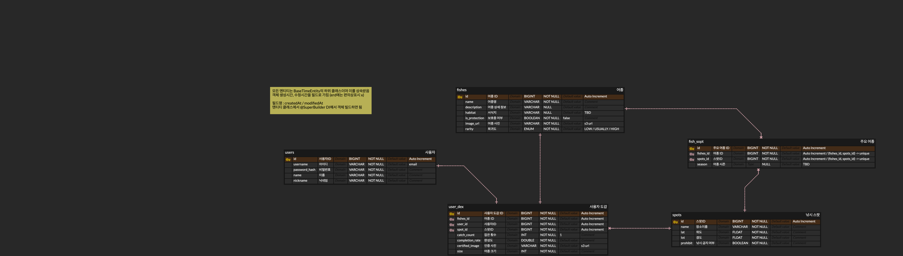

# spec.md — API 엔드포인트·모델(ERD)

> API 명세와 DB 모델의 단일 출처. 코드 추가/변경 시 **이 문서를 함께 갱신**합니다 (`docs/conventions.md`). 현재는 스켈레톤 + 초안입니다.

## API 엔드포인트

모든 API는 `/api` 베이스 경로. 응답은 공통 응답 포맷(`docs/architecture.md`) 확정 후 반영.

| 상태 | Method | Path | 설명 | 인증 |
|---|---|---|---|---|
| ✅ | GET | `/api/health` | 헬스 체크 `{"status":"ok"}` | 공개 |
| 📋 | POST | `/api/auth/signup` | 회원가입 | 공개 |
| 📋 | POST | `/api/auth/login` | 로그인(JWT 발급) | 공개 |
| 📋 | GET | `/api/spots` | 낚시 스팟 목록/주변 검색 (DB 불변 정보만) | 공개 |
| 📋 | GET | `/api/spots/{id}` | 스팟 상세 = DB 기본정보 + **실시간 예보(낚시지수·날씨·물때·대상 어종)** 병합 | 공개 |
| 📋 | GET | `/api/fish` | 어종 목록/도감 기준 데이터 | 공개 |
| 📋 | POST | `/api/collections/verify` | 어종 사진 인증 업로드 | 보호 |
| 📋 | GET | `/api/collections/me` | 내 어종 도감 조회 | 보호 |

> 위 경로는 초안입니다. 도메인 확정 시 Request/Response 스키마와 함께 상세화.

## Request / Response 스키마
📋 TBD — 엔드포인트별로 요청/응답 예시(JSON)와 유효성 규칙을 여기에 기록.

## 스팟 데이터 설계 — 저장(불변) vs 실시간(예보) 🚧

스팟 정보를 성격에 따라 **DB 저장**과 **요청 시 실시간 호출**로 분리합니다. (바다낚시지수 API 15142486 → `docs/external.md` §1)

| 성격 | 대상 | 처리 |
|---|---|---|
| **불변** | 위치명·위도·경도(그리고 서비스 운영값 `prohibit`) | DB에 시드 저장(`spots`). 목록/지도 마커·주변 검색에 사용 |
| **정적 매핑** | 스팟에서 잡히는 대상 어종(`seafsTgfshNm`) | DB에 시드 저장(`fish_sopt`, `fishes` 연동). 배치로 스팟별 어종 수집·고유화 |
| **예보성(가변)** | 낚시지수(`totalIndex`/`lastScr`)·날씨(파고·수온·기온·유속·풍속)·물때(`tdlvHrScr`/`tdlvHrCn`) | **저장하지 않음.** 스팟 **상세 조회 시점**에 외부 API를 호출·파싱해 응답에 병합 |

**흐름:** `GET /api/spots/{id}` → ① DB에서 스팟 기본정보 + 대상 어종(`fish_sopt`) 조회 → ② 외부 API 예보(Redis 캐시)에서 해당 스팟의 낚시지수·날씨·물때 파싱 → ③ 병합 응답.

**설계 결정 사항**
- **대상 어종 = 정적 매핑 단일화 ✅(확정):** 대상 어종(`seafsTgfshNm`)은 **오전/오후·날짜에 무관하게 고정**임을 실측으로 확인(7일치 294개 (스팟,일자) 조합에서 오전 vs 오후 차이 0건, 스팟별 어종 집합 불변). 따라서 예보가 아니라 **스팟의 정적 속성**으로 취급하여 **`fish_sopt`에 저장하는 한 갈래로만** 처리한다. (실시간 파싱으로 어종을 뽑는 방식은 폐기.)
  - `fish_sopt`에 배치로 **(스팟, 어종) 페어**를 수집·고유화하고 `fishes.name`에 매핑. 스팟 상세의 "주요 대상 어종" 목록·도감(`user_dex`)/완성도 기준.
  - 유의: 현재 `fishDex.py`는 *전역* 고유 어종만 집계 → 스팟별 페어 집계로 **수집 확장 필요**. 어종명→`fishes` 매핑 규칙, `season`(어종 시즌)은 API에 없어 **TBD**.
  - 단, 위 실측은 7일 스냅샷 기준이라 **계절 단위 변동 가능성**은 열려 있음 → 주기적(예: 월 1회) 재수집으로 `fish_sopt` 갱신 권장.
- **호출 효율/캐싱 ✅:** 예보(낚시지수·날씨·물때)는 API가 스팟 단건 필터 없이 `gubun`별 전체(약 1,750건)를 페이지네이션으로 반환 → 상세 요청마다 원본 호출은 지연·쿼터 위험. **Redis 캐시, 반나절 TTL로 확정**(예보 주기가 `predcYmd`+`predcNoonSeCd`로 굵음). 전체 예보를 캐시하고 상세는 `seafsPstnNm`으로 필터해 서빙.
- **실패 격리 📋 TBD:** 예보 외부 호출이 상세 응답 경로에 있음 → 타임아웃·재시도·폴백(DB 기본정보+대상 어종은 항상 응답, 예보 블록만 `null`+안내) 정책은 **TBD**. → `docs/external.md` 공통 규칙과 함께 확정.

## 데이터 모델 (ERD)

> **⚠️ 초안 v0.1 — 수정 가능성 있음.** 아래 이미지가 현재 draft이며, 컬럼·관계는 도메인 구현과 함께 확정됩니다.
> 모든 엔티티는 `BaseTimeEntity`를 상속해 `createdAt`/`modifiedAt`을 가집니다(ERD에는 편의상 미표기, `@SuperBuilder` 사용 → `docs/conventions.md`).



### 엔티티 요약 (이미지 기준 v0.1)

| 테이블 | 역할 | 주요 컬럼 |
|---|---|---|
| `users` | 사용자 | `id`, `username`(email), `password_hash`, `name`, `nickname` |
| `fishes` | 어종(도감 기준) | `id`, `name`, `description`, `habitat`(TBD), `is_protection`(default false), `image_url`(s3), `rarity`(ENUM LOW/USUALLY/HIGH) |
| `fish_sopt` | 스팟-어종 매핑(주요 어종) | `id`, `fishes_id`·`spots_id`(FK, 조합 UNIQUE), `season`(TBD) |
| `user_dex` | 사용자 도감(인증) | `id`, `fishes_id`·`user_id`·`spot_id`(FK), `catch_count`(default 1), `completion_rate`, `certified_image`(s3), `size` |
| `spots` | 낚시 스팟 | `id`, `name`, `lat`, `lot`, `prohibit` |

### spots (낚시 스팟) 🚧
바다낚시지수 API(15142486)에서 **불변 정보만** 추출해 시드 저장 → `docs/external.md` §1, `docs/geo.md`. (컬럼명은 ERD v0.1 기준)

| 컬럼 | 타입 | 제약 | 설명 | 출처 |
|---|---|---|---|---|
| `id` | BIGINT | PK, auto | 스팟 식별자 | (내부 생성) |
| `name` | VARCHAR | NOT NULL | 위치명(장소이름) | API `seafsPstnNm` |
| `lat` | FLOAT | NOT NULL | 위도 | API `lat` |
| `lot` | FLOAT | NOT NULL | 경도 | API `lot` |
| `prohibit` | BOOLEAN | NOT NULL | 낚시 금지 여부 | 서비스 운영값(API 아님) |

- 현재 **49행**(고유 위치명, 추후 추가 가능). 이름이 유일하므로 시드 upsert 기준 키로 사용 가능(UNIQUE 제약 부여 여부는 v0.1에서 미확정).
- 예보성 필드(낚시지수·날씨·물때·대상 어종)는 저장하지 않고 상세 조회 시 실시간 호출 → 위 "스팟 데이터 설계" 참고.

```
User(users) 1 ──< user_dex >── 1 Fish(fishes)      # 사용자 도감(인증)
Spot(spots) 1 ──< fish_sopt >── 1 Fish(fishes)     # 스팟-어종 매핑
Spot(spots) 1 ──< user_dex                          # 어느 스팟에서 인증했는지
```