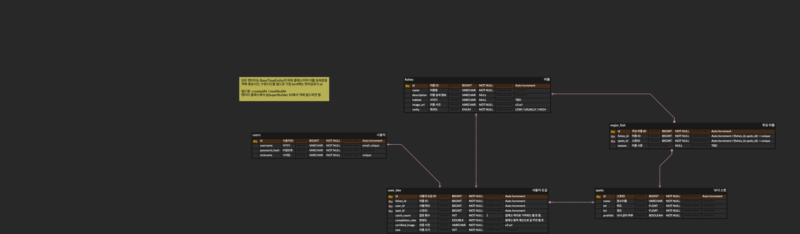

# spec.md — API 엔드포인트·모델(ERD)

> API 명세와 DB 모델의 단일 출처. 코드 추가/변경 시 **이 문서를 함께 갱신**합니다 (`docs/conventions.md`). 현재는 스켈레톤 + 초안입니다.

## API 엔드포인트

모든 API는 `/api` 베이스 경로. 응답은 공통 응답 포맷(`docs/architecture.md`) 확정 후 반영.

| 상태 | Method | Path | 설명 | 인증 |
|---|---|---|---|---|
| ✅ | GET | `/api/health` | 헬스 체크 `{"status":"ok"}` | 공개 |
| 📋 | POST | `/api/auth/email/send-code` | 회원가입 이메일 인증코드(6자리) 발송 | 공개 |
| 📋 | POST | `/api/auth/email/verify-code` | 이메일 인증코드 확인 | 공개 |
| 📋 | POST | `/api/auth/signup` | 회원가입 완료(비밀번호·닉네임) → JWT 발급 | 공개 |
| 📋 | POST | `/api/auth/login` | 로그인(JWT 발급) | 공개 |
| 📋 | POST | `/api/auth/refresh` | Access/Refresh 재발급(회전) | 공개 |
| 📋 | POST | `/api/auth/logout` | 로그아웃(Refresh 무효화) | 보호 |
| 📋 | GET | `/api/spots` | 낚시 스팟 목록/주변 검색 (DB 불변 정보만) | 공개 |
| 📋 | GET | `/api/spots/{id}` | 스팟 상세 = DB 기본정보 + **실시간 예보(낚시지수·날씨·물때·대상 어종)** 병합 | 공개 |
| 📋 | GET | `/api/fish` | 어종 목록/도감 기준 데이터 | 공개 |
| 📋 | POST | `/api/collections/verify` | 어종 사진 인증 업로드 | 보호 |
| 📋 | GET | `/api/collections/me` | 내 어종 도감 조회 | 보호 |

> 위 경로는 초안입니다. 도메인 확정 시 Request/Response 스키마와 함께 상세화.

## Request / Response 스키마

모든 응답은 공통 래퍼 `BaseResponse<T>`(`success`/`code`/`message`/`data`)로 감싼다. 아래는 `data` 필드 기준이며, 실패는 예외 → `GlobalExceptionHandler`가 변환한다(`docs/architecture.md`). 인증 흐름·정책의 근거는 `docs/security.md`.

### 인증 (`/api/auth`) 📋

인증 흐름: **① send-code → ② verify-code → ③ signup**. 각 단계 통과는 Redis 인증완료 플래그로 다음 단계에 전달된다(`docs/security.md` §1).

#### ① `POST /api/auth/email/send-code` — 인증코드 발송
```jsonc
// Request
{ "email": "angler@fishlog.com" }
// Response(data)
{ "expiresInSec": 300 }          // 코드 유효시간(초)
```
- 검증: `email` 형식·필수. 이미 가입된 이메일이면 `409 EMAIL_ALREADY_EXISTS`.
- 남용 방지: 재전송 쿨다운 30초·시간당 5회 초과 시 `429`(`data.retryAfterSec`).

#### ② `POST /api/auth/email/verify-code` — 인증코드 확인
```jsonc
// Request
{ "email": "angler@fishlog.com", "code": "482913" }   // code: 숫자 6자리
// Response(data): null (message로 안내)
```
- 만료/미발송 `VERIFICATION_CODE_EXPIRED`, 불일치 `VERIFICATION_CODE_MISMATCH`(5회 오입력 시 코드 무효화).
- 성공 시 인증완료 플래그(TTL 10분) 설정 → 이 안에 signup 완료해야 함.

#### ③ `POST /api/auth/signup` — 회원가입 완료
```jsonc
// Request
{
  "email": "angler@fishlog.com",   // verify-code로 인증된 이메일
  "password": "fishlog1234",        // 8자 이상, 영문+숫자
  "nickname": "붕어킬러"             // 2~10자, 유니크
}
// Response(data)
{
  "userId": 1,
  "nickname": "붕어킬러",
  "accessToken": "eyJhbGciOi...",
  "refreshToken": "eyJhbGciOi...",
  "accessTokenExpiresIn": 1800
}
```
- 이메일 미인증 `EMAIL_NOT_VERIFIED`, 이메일 선점 `EMAIL_ALREADY_EXISTS`, 닉네임 중복 `NICKNAME_ALREADY_EXISTS`.
- 성공 시 비밀번호 BCrypt 해시 저장 + 로그인과 동일한 토큰 발급(가입 즉시 로그인).

#### `POST /api/auth/login` — 로그인
```jsonc
// Request
{ "email": "angler@fishlog.com", "password": "fishlog1234" }
// Response(data): signup과 동일한 토큰 응답
{ "userId": 1, "nickname": "붕어킬러", "accessToken": "...", "refreshToken": "...", "accessTokenExpiresIn": 1800 }
```
- 이메일 미존재·비밀번호 불일치는 계정 열거 방지를 위해 동일 메시지 `INVALID_CREDENTIALS`(`401`).

#### `POST /api/auth/refresh` — 토큰 재발급(회전)
```jsonc
// Request
{ "refreshToken": "eyJhbGciOi..." }
// Response(data): 새 access + 새 refresh (기존 refresh 무효화)
{ "accessToken": "...", "refreshToken": "...", "accessTokenExpiresIn": 1800 }
```
- 서명·만료 실패 또는 서버 저장값 불일치(재사용) → `401 INVALID_REFRESH_TOKEN`.

#### `POST /api/auth/logout` — 로그아웃 (보호)
- `Authorization: Bearer {accessToken}` 필요. 서버의 refresh(`auth:refresh:{userId}`) 삭제. `data: null`.

> 토큰 만료·저장·회전 정책과 오류 코드(`A00x`) 전체는 `docs/security.md`(§2, §5).

### 기타 엔드포인트
📋 TBD — 스팟·어종·도감 등 엔드포인트별 요청/응답 예시와 유효성 규칙을 여기에 추가.

## 스팟 데이터 설계 — 저장(불변) vs 실시간(예보) 🚧

스팟 정보를 성격에 따라 **DB 저장**과 **요청 시 실시간 호출**로 분리합니다. (바다낚시지수 API 15142486 → `docs/external.md` §1)

| 성격 | 대상 | 처리 |
|---|---|---|
| **불변** | 위치명·위도·경도(그리고 서비스 운영값 `prohibit`) | DB에 시드 저장(`spots`). 목록/지도 마커·주변 검색에 사용 |
| **정적 매핑** | 스팟에서 잡히는 대상 어종(`seafsTgfshNm`) | DB에 시드 저장(`major_fish`, `fishes` 연동). 배치로 스팟별 어종 수집·고유화 |
| **예보성(가변)** | 낚시지수(`totalIndex`/`lastScr`)·날씨(파고·수온·기온·유속·풍속)·물때(`tdlvHrScr`/`tdlvHrCn`) | **저장하지 않음.** 스팟 **상세 조회 시점**에 외부 API를 호출·파싱해 응답에 병합 |

**흐름:** `GET /api/spots/{id}` → ① DB에서 스팟 기본정보 + 대상 어종(`major_fish`) 조회 → ② 외부 API 예보(Redis 캐시)에서 해당 스팟의 낚시지수·날씨·물때 파싱 → ③ 병합 응답.

**설계 결정 사항**
- **대상 어종 = 정적 매핑 단일화 ✅(확정):** 대상 어종(`seafsTgfshNm`)은 **오전/오후·날짜에 무관하게 고정**임을 실측으로 확인(7일치 294개 (스팟,일자) 조합에서 오전 vs 오후 차이 0건, 스팟별 어종 집합 불변). 따라서 예보가 아니라 **스팟의 정적 속성**으로 취급하여 **`major_fish`에 저장하는 한 갈래로만** 처리한다. (실시간 파싱으로 어종을 뽑는 방식은 폐기.)
  - `major_fish`에 배치로 **(스팟, 어종) 페어**를 수집·고유화하고 `fishes.name`에 매핑. 스팟 상세의 "주요 대상 어종" 목록·도감(`user_dex`)/완성도 기준.
  - **수집 결과(현재):** 고유 스팟 **49개**, (스팟,어종) 페어 **160개**. 어종은 API가 제공하는 **7종**(감성돔·농어·돌돔·벵에돔·우럭·참돔 + `기타어종`). 수집기 `data/spot/seed.py`가 두 시드(`spots_seed.json`·`spot_fish_seed.json`)를 생성 → `docs/external.md` §1.
  - 어종명→`fishes` 매핑 규칙, `season`(어종 시즌)은 API에 없어 **TBD**.
  - 단, 위 실측은 7일 스냅샷 기준이라 **계절 단위 변동 가능성**은 열려 있음 → 주기적(예: 월 1회) 재수집으로 `major_fish` 갱신 권장.
- **`기타어종` 처리 📋 TBD:** API의 catch-all 카테고리 `기타어종`(현재 34개 페어)은 특정 어종이 아니라 도감 항목으로 부적절할 수 있으나, **우선 일반 어종처럼 `fishes`/`major_fish`에 그대로 포함**한다. 도감(수집) 대상에서 제외할지·별도 플래그(예: `is_collectible`)를 둘지는 **TBD**.
  - **후속 계획 📋 TBD:** `기타어종`이 실제로 어떤 어종들을 포괄하는지 **별도 조사** 후, 그 결과로 **도감(`fishes`)을 더 풍부하게 채워 넣을** 예정. (바다낚시지수 API가 제공하는 어종은 6종뿐이라 도감 콘텐츠로는 부족 → 어종 마스터 카탈로그는 이 API와 분리해 확장하는 방향, 상세 미확정.)
  - **플레이스홀더 `-` 제외 ✅:** 대상어종 없음(`-`)은 실어종이 아니므로 `major_fish` 시드에서 제외한다(수집기에서 필터).
- **대상 어종 없는 스팟 = 빈 값 허용 ✅(확정):** 선상 오프셋 지명 스팟(예: `안흥항서측(40km)`) 등 **15개 스팟**은 API에 특정 대상어종이 없다. 이 스팟은 `major_fish` 매핑이 **0건**이어도 무방하며, 상세 응답의 "주요 대상 어종"은 **빈 값(정보 없음)** 으로 처리한다.
- **호출 효율/캐싱 ✅:** 예보(낚시지수·날씨·물때)는 API가 스팟 단건 필터 없이 `gubun`별 전체(약 1,750건)를 페이지네이션으로 반환 → 상세 요청마다 원본 호출은 지연·쿼터 위험. **Redis 캐시, 반나절 TTL로 확정**(예보 주기가 `predcYmd`+`predcNoonSeCd`로 굵음). 전체 예보를 캐시하고 상세는 `seafsPstnNm`으로 필터해 서빙.
- **실패 격리 📋 TBD:** 예보 외부 호출이 상세 응답 경로에 있음 → 타임아웃·재시도·폴백(DB 기본정보+대상 어종은 항상 응답, 예보 블록만 `null`+안내) 정책은 **TBD**. → `docs/external.md` 공통 규칙과 함께 확정.
- **시드 적재 전략(환경별) 🚧:**
  - **로컬 ✅:** `data/spot/seed.py` 산출 JSON을 `global/init`의 `SeedDataInitializer`(@PostConstruct)+`SpotSeedLoader`가 적재. `fishlog.seed.enabled=true`일 때만 동작하고, 이미 적재됐으면(`spots.count()>0`) 건너뜀(idempotent).
  - **운영(prod) = Flyway 마이그레이션 도입 결정, 구현 📋 TBD:** 운영 시드/레퍼런스 데이터는 **Flyway(버전드 SQL 마이그레이션)로 적재·갱신**한다.
    - **근거:** 어종 카탈로그(`fishes`)를 API 제공 6종 외에 **수동 큐레이션으로 +20~30종 점진 확장**할 예정이라, "비었을 때 1회 적재"(JSON+count 가드)로는 증분 갱신이 안 됨 → 버전드 증분·이력·재현성이 필요.
    - **TBD 항목:** `flyway`(+`flyway-mysql`) 의존성 추가, 스키마 관리 이관(prod `ddl-auto=validate`/`none` 전환, 로컬 정책), 초기 시드(JSON→`V__init_*.sql`) 및 큐레이션 배치(`V__add_fishes_*.sql`) 생성·버전 관리 절차, 로컬 부트스트랩을 JSON 로더 유지 vs Flyway 통일.

## 데이터 모델 (ERD)

> **⚠️ 초안 v0.4 — 수정 가능성 있음.** 아래 이미지가 현재 draft이며, 컬럼·관계는 도메인 구현과 함께 확정됩니다.
> 모든 엔티티는 `BaseTimeEntity`를 상속해 `createdAt`/`modifiedAt`을 가집니다(ERD에는 편의상 미표기, `@SuperBuilder` 사용 → `docs/conventions.md`).



### 엔티티 요약 (이미지 기준 v0.4)

| 테이블 | 역할 | 주요 컬럼 |
|---|---|---|
| `users` | 사용자 | `id`, `username`(email, UNIQUE), `password_hash`, `nickname`(UNIQUE) |
| `fishes` | 어종(도감 기준) | `id`, `name`, `description`, `habitat`(TBD), `image_url`(s3), `rarity`(ENUM LOW/USUALLY/HIGH) |
| `major_fish` | 스팟-어종 매핑(주요 어종, 구 `fish_sopt`) | `id`, `fishes_id`·`spots_id`(FK, 조합 UNIQUE), `season`(TBD) |
| `user_dex` | 사용자 도감(인증) | `id`, `fishes_id`·`user_id`·`spot_id`(FK), `catch_count`(default 1), `completion_rate`, `certified_image`(s3), `size` |
| `spots` | 낚시 스팟 | `id`, `name`, `lat`, `lot`, `prohibit` |

### users (사용자) 📋
자체 이메일/비밀번호 로그인 주체. 회원가입은 **이메일/비밀번호/닉네임만** 받는다. 인증 흐름·정책은 `docs/security.md`.

| 컬럼 | 타입 | 제약 | 설명 |
|---|---|---|---|
| `id` | BIGINT | PK, auto | 사용자 식별자 |
| `username` | VARCHAR | NOT NULL, UNIQUE | 로그인 이메일 |
| `password_hash` | VARCHAR | NOT NULL | BCrypt 해시(평문 저장 금지) |
| `nickname` | VARCHAR | NOT NULL, UNIQUE | 표시 이름(2~10자) |

- `BaseTimeEntity` 상속 → `created_at`/`modified_at` 자동(`docs/conventions.md`).
- 이메일 인증코드·refresh 토큰은 **DB가 아닌 Redis**에 저장(`auth:email:*`, `auth:refresh:*`).
- **권한(`role`) 컬럼은 현재 미포함** — 전원 일반 사용자다. 관리자(`ADMIN`) 기능이 필요해지는 시점에 `role` 컬럼을 추가한다(그때 `security.md` 인가 정책과 함께 확정).

### spots (낚시 스팟) 🚧
바다낚시지수 API(15142486)에서 **불변 정보만** 추출해 시드 저장 → `docs/external.md` §1, `docs/geo.md`. (컬럼명은 ERD v0.4 기준)

| 컬럼 | 타입 | 제약 | 설명 | 출처 |
|---|---|---|---|---|
| `id` | BIGINT | PK, auto | 스팟 식별자 | (내부 생성) |
| `name` | VARCHAR | NOT NULL | 위치명(장소이름) | API `seafsPstnNm` |
| `lat` | FLOAT | NOT NULL | 위도 | API `lat` |
| `lot` | FLOAT | NOT NULL | 경도 | API `lot` |
| `prohibit` | BOOLEAN | NOT NULL | 낚시 금지 여부 | 서비스 운영값(API 아님) |

- 현재 **49행**(고유 위치명, 추후 추가 가능). 이름이 유일하므로 시드 upsert 기준 키로 사용 가능(UNIQUE 제약 부여 여부는 v0.4 기준 미확정).
- 예보성 필드(낚시지수·날씨·물때·대상 어종)는 저장하지 않고 상세 조회 시 실시간 호출 → 위 "스팟 데이터 설계" 참고.

```
User(users) 1 ──< user_dex >── 1 Fish(fishes)      # 사용자 도감(인증)
Spot(spots) 1 ──< major_fish >── 1 Fish(fishes)     # 스팟-어종 매핑
Spot(spots) 1 ──< user_dex                          # 어느 스팟에서 인증했는지
```