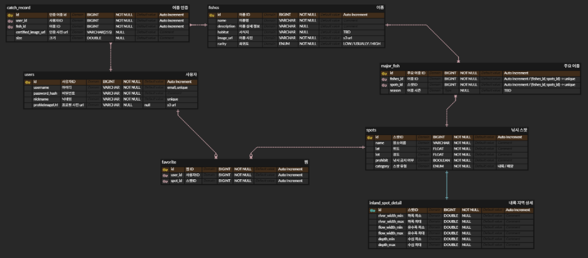

# spec.md — API 엔드포인트·모델(ERD)

> API 명세와 DB 모델의 단일 출처. 코드 추가/변경 시 **이 문서를 함께 갱신**합니다 (`docs/conventions.md`). 현재는 스켈레톤 + 초안입니다.

## API 엔드포인트

모든 API는 `/api` 베이스 경로. 응답은 공통 응답 포맷(`docs/architecture.md`) 확정 후 반영.

| 상태 | Method | Path | 설명 | 인증 |
|---|---|---|---|---|
| ✅ | POST | `/api/auth/email/send-code` | 회원가입 이메일 인증코드(6자리) 발송 | 공개 |
| ✅ | POST | `/api/auth/email/verify-code` | 이메일 인증코드 확인 | 공개 |
| ✅ | POST | `/api/auth/signup` | 회원가입 완료(비밀번호·닉네임) — 토큰 미발급 | 공개 |
| ✅ | POST | `/api/auth/login` | 로그인(JWT 발급) | 공개 |
| ✅ | POST | `/api/auth/refresh` | Access/Refresh 재발급(회전) | 공개 |
| ✅ | POST | `/api/auth/logout` | 로그아웃(Refresh 무효화) | 보호 |
| ✅ | POST | `/api/auth/password/send-code` | 비밀번호 재설정 인증코드 발송(가입자만) | 공개 |
| ✅ | POST | `/api/auth/password/verify-code` | 비밀번호 재설정 인증코드 확인 | 공개 |
| ✅ | POST | `/api/auth/password/reset` | 비밀번호 재설정(새 비번 교체 + 기존 세션 무효화) | 공개 |
| ✅ | GET | `/api/users/me` | 내 프로필 조회(마이페이지, 이메일·닉네임) | 보호 |
| ✅ | PATCH | `/api/users/me/nickname` | 닉네임 변경(마이페이지) | 보호 |
| ✅ | PATCH | `/api/users/me/password` | 비밀번호 변경(마이페이지, 현재 비번 확인 + 기존 세션 무효화) | 보호 |
| ✅ | DELETE | `/api/users/me` | 회원탈퇴(현재 비번 확인, 사용자·도감기록 하드 삭제) | 보호 |
| ✅ | POST | `/api/users/me/profile-image` | 프로필 이미지 업로드/변경(multipart, S3) | 보호 |
| ✅ | GET | `/api/spots` | 낚시 스팟 목록(지도 마커, 좌표·`category`·`isFavorite`(찜 여부)) | 보호 |
| ✅ | GET | `/api/spots/{id}` | 스팟 상세 = DB 기본정보 + 대상 어종 + **해양: 실시간 예보 / 내륙: 하천 제원(하폭·유수폭·수심)** | 공개 |
| ✅ | POST | `/api/spots/{spotId}/favorite` | 스팟 찜 추가(idempotent) | 보호 |
| ✅ | DELETE | `/api/spots/{spotId}/favorite` | 스팟 찜 해제(idempotent) | 보호 |
| ✅ | GET | `/api/fish/{id}` | 어종 상세 | 공개 |
| ✅ | GET | `/api/collections` | 특정 어종의 내 인증 요약(잡은 횟수 + 인증 사진 URL 목록). `fishId` 파라미터 | 보호 |
| ✅ | POST | `/api/collections/classify` | 사진으로 어종 후보(Top-3) 분류. **저장 없음(순수 조회)** → `docs/external.md` §2 | 보호 |
| ✅ | POST | `/api/collections/verify` | 어종 사진 인증 업로드(S3) + 도감 기록 | 보호 |
| ✅ | GET | `/api/collections/dex` | 내 어종 도감 그리드 조회(전체 어종 + 각 어종 `caught` 여부) | 보호 |
| ✅ | GET | `/api/rankings/completion` | 도감 완성도 랭킹(전체 순위, 토큰 있으면 내 순위) → `docs/ranking.md` | 공개(`me`는 토큰 시) |
| ✅ | GET | `/api/rankings/size` | 최대 어종 크기 랭킹(전체 순위, 토큰 있으면 내 순위) → `docs/ranking.md` | 공개(`me`는 토큰 시) |

> 위 경로는 초안입니다. 도메인 확정 시 Request/Response 스키마와 함께 상세화.

## Request / Response 스키마

모든 응답은 공통 래퍼 `BaseResponse<T>`(`success`/`code`/`message`/`data`)로 감싼다. 아래는 `data` 필드 기준이며, 실패는 예외 → `GlobalExceptionHandler`가 변환한다(`docs/architecture.md`). 인증 흐름·정책의 근거는 `docs/security.md`.

### 인증 (`/api/auth`) ✅

인증 흐름: **① send-code → ② verify-code → ③ signup**. 각 단계 통과는 Redis 인증완료 플래그로 다음 단계에 전달된다(`docs/security.md` §1).

#### ① `POST /api/auth/email/send-code` — 인증코드 발송 ✅
```jsonc
// Request
{ "email": "angler@gmail.com" }
// Response(data)
{ "codeTtlSeconds": 300 }          // 코드 유효시간(초)
```
- 검증: `email` 형식·필수. 이미 가입된 이메일이면 `409 EMAIL_ALREADY_EXISTS`. 허용 도메인 밖이면 `400 EMAIL_DOMAIN_NOT_ALLOWED`(`auth.allowed-email-domains` 미설정 시 제한 없음).
- 남용 방지: 재전송 쿨다운 30초·시간당 5회 초과 시 `429`(`data.retryAfterSec`).

#### ② `POST /api/auth/email/verify-code` — 인증코드 확인 ✅
```jsonc
// Request
{ "email": "angler@gmail.com", "code": "482913" }   // code: 숫자 6자리
// Response(data)
{ "verifiedTtlSeconds": 600 }      // 인증완료 상태 유지시간(초, 이 안에 가입 완료)
```
- 만료/미발송 `VERIFICATION_CODE_EXPIRED`, 불일치 `VERIFICATION_CODE_MISMATCH`(5회 오입력 시 코드 무효화).
- 성공 시 인증완료 플래그(TTL 10분) 설정 → 이 안에 signup 완료해야 함.

#### ③ `POST /api/auth/signup` — 회원가입 완료 ✅
```jsonc
// Request
{
  "email": "angler@fishlog.com",   // verify-code로 인증된 이메일
  "password": "fishlog1234",        // 8자 이상, 영문+숫자
  "nickname": "붕어킬러"             // 2~10자, 유니크
}
// Response(data)
{ "userId": 1, "nickname": "붕어킬러" }
```
- 이메일 미인증 `EMAIL_NOT_VERIFIED`, 이메일 선점 `EMAIL_ALREADY_EXISTS`, 닉네임 중복 `NICKNAME_ALREADY_EXISTS`.
- 성공 시 비밀번호 BCrypt 해시 저장. **토큰은 발급하지 않으며**, 가입 후 로그인 API로 발급받는다.

#### `POST /api/auth/login` — 로그인 ✅
```jsonc
// Request
{ "email": "angler@fishlog.com", "password": "fishlog1234" }
// Response(data): 토큰 발급(Access/Refresh)
{ "userId": 1, "nickname": "붕어킬러", "accessToken": "...", "refreshToken": "...", "accessTokenExpiresIn": 1800 }
```
- 이메일 미존재·비밀번호 불일치는 계정 열거 방지를 위해 동일 메시지 `INVALID_CREDENTIALS`(`401`).

#### `POST /api/auth/refresh` — 토큰 재발급(회전) ✅
```jsonc
// Request
{ "refreshToken": "eyJhbGciOi..." }
// Response(data): signup/login과 동일한 토큰 응답 (새 access + 새 refresh, 기존 refresh 무효화)
{ "userId": 1, "nickname": "붕어킬러", "accessToken": "...", "refreshToken": "...", "accessTokenExpiresIn": 1800 }
```
- 서명·만료 실패 또는 서버 저장값 불일치(재사용) → `401 INVALID_REFRESH_TOKEN`.

#### `POST /api/auth/logout` — 로그아웃 (보호) ✅
- `Authorization: Bearer {accessToken}` 필요. 서버의 refresh(`auth:refresh:{userId}`) 삭제. `data: null`.

> 토큰 만료·저장·회전 정책과 오류 코드(`A00x`) 전체는 `docs/security.md`(§2, §5).

#### 비밀번호 재설정(찾기) ✅

재설정 흐름: **① password/send-code → ② password/verify-code → ③ password/reset**. 가입 흐름과 동일 패턴이나 상태는 별도 Redis 네임스페이스(`auth:password:*`)에 저장되고, 대상은 **가입된 사용자**다(`docs/security.md` §2-B).

#### `POST /api/auth/password/send-code` — 재설정 인증코드 발송 ✅
```jsonc
// Request
{ "email": "angler@gmail.com" }
// Response(data)
{ "codeTtlSeconds": 300 }          // 코드 유효시간(초)
```
- **가입되지 않은 이메일이면 `404 EMAIL_NOT_FOUND`**(회원가입 send-code와 반대).
- 남용 방지: 재전송 쿨다운 30초·시간당 5회 초과 시 `429`(`data.retryAfterSec`).

#### `POST /api/auth/password/verify-code` — 재설정 인증코드 확인 ✅
```jsonc
// Request
{ "email": "angler@gmail.com", "code": "482913" }   // code: 숫자 6자리
// Response(data)
{ "verifiedTtlSeconds": 600 }      // 재설정 인증완료 상태 유지시간(초)
```
- 만료/미발송 `VERIFICATION_CODE_EXPIRED`, 불일치 `VERIFICATION_CODE_MISMATCH`(5회 오입력 시 코드 무효화).
- 성공 시 재설정 인증완료 플래그(`auth:password:verified:{email}`, TTL 10분) 설정 → 이 안에 reset 완료해야 함.

#### `POST /api/auth/password/reset` — 비밀번호 재설정 ✅
```jsonc
// Request
{ "email": "angler@gmail.com", "newPassword": "fishlog5678" }   // 8자 이상, 영문+숫자
// Response
// data: null
```
- 인증완료 플래그 없으면 `400 PASSWORD_RESET_NOT_VERIFIED`, 사용자 미존재 시 `404 EMAIL_NOT_FOUND`.
- 성공 시 비밀번호 BCrypt 재해시 저장 → 인증완료 플래그 소비 → **기존 refresh(`auth:refresh:{userId}`) 삭제**(세션 무효화). **토큰은 발급하지 않으며** 새 비밀번호로 다시 로그인한다.

### 마이페이지 (`/api/users`) ✅

로그인 사용자 본인의 프로필 조회·수정. 모두 **보호 엔드포인트**(`Authorization: Bearer {accessToken}` 필요)이며, 대상은 토큰의 사용자(`@AuthenticationPrincipal`)로 식별한다(요청 body/파라미터로 userId를 받지 않음). 도메인 에러코드는 `U0xx`(`docs/security.md` §5). 비로그인 "비밀번호 찾기"(`/api/auth/password/*`)와 별개다.

#### `GET /api/users/me` — 내 프로필 조회 ✅
```jsonc
// Response(data)
{ "userId": 1, "email": "angler@gmail.com", "nickname": "붕어킬러",
  "profileImageUrl": "https://fishlog-bucket.s3.ap-northeast-2.amazonaws.com/profile/uuid.png" }
```
- 토큰의 사용자가 없으면 `404 USER_NOT_FOUND`, 미인증 `401`.
- `profileImageUrl`은 미설정 시 `null`(기본 이미지는 클라이언트 처리).

#### `PATCH /api/users/me/nickname` — 닉네임 변경 ✅
```jsonc
// Request
{ "nickname": "감성돔사냥꾼" }   // 2~10자, 유니크
// Response
// data: null
```
- 현재 닉네임과 동일하면 변경 없이 성공(no-op). 중복이면 `409 NICKNAME_ALREADY_EXISTS`.

#### `PATCH /api/users/me/password` — 비밀번호 변경 ✅
```jsonc
// Request
{ "currentPassword": "fishlog1234", "newPassword": "fishlog5678" }   // new: 8자 이상, 영문+숫자
// Response
// data: null
```
- 현재 비밀번호 불일치 `400 INVALID_CURRENT_PASSWORD`, 새 비번이 현재와 동일 `400 SAME_AS_CURRENT_PASSWORD`.
- 성공 시 새 비번 BCrypt 재해시 저장 → **기존 refresh(`auth:refresh:{userId}`) 삭제**(세션 무효화) → 새 비밀번호로 재로그인 필요.

#### `DELETE /api/users/me` — 회원탈퇴 ✅
```jsonc
// Request
{ "password": "fishlog1234" }   // 본인 확인용 현재 비밀번호
// Response
// data: null
```
- 비밀번호 불일치 `400 INVALID_CURRENT_PASSWORD`, 사용자 미존재 `404 USER_NOT_FOUND`.
- **하드 삭제**: 사용자(`users`) + 그 사용자의 **도감 인증기록(`catch_record`)** 을 함께 삭제하고 refresh(`auth:refresh:{userId}`)를 무효화한다. `catch_record.user_id`는 FK가 아니라(plain Long) DB 캐스케이드가 없어 명시 삭제하며, 남기면 랭킹에 유령 userId로 잡힌다. 되돌릴 수 없다.

#### `POST /api/users/me/profile-image` — 프로필 이미지 업로드/변경 ✅

`multipart/form-data`로 `image` 파트에 이미지 파일을 담아 전송. S3(`profile/` 경로)에 업로드하고 URL을 `users.profile_image_url`에 저장한다. 기존 이미지가 있으면 삭제(best-effort). → `docs/media.md`
```jsonc
// Request: multipart/form-data
//   image=<이미지 파일>   (이미지만, 최대 5MB)
// Response(data)
{ "profileImageUrl": "https://fishlog-bucket.s3.ap-northeast-2.amazonaws.com/profile/uuid.png" }
```
- 파일 검증(`global/s3` 에서 수행): 파일 없음 `EMPTY_FILE(400)`, 이미지 아님 `INVALID_FILE_TYPE(400)`, 5MB 초과 `FILE_SIZE_EXCEEDED(400)`, 업로드 실패 `UPLOAD_FAILED(500)`.
- 사용자 미존재 `404 USER_NOT_FOUND`, 미인증 `401`.

### 낚시 스팟 (`/api/spots`) ✅

#### `GET /api/spots` — 스팟 목록 ✅ (보호)

지도 마커용 전체 스팟(좌표·분류) + **로그인 사용자의 찜 여부(`isFavorite`)**. 찜 여부 계산을 위해 **보호 API**(`Authorization: Bearer` 필요)다. 찜한 spotId 집합을 1쿼리로 조회해 메모리 병합(N+1 없음).
```jsonc
// Response(data)
[
  { "id": 1, "name": "가거도", "lat": 34.07308, "lot": 125.08805, "category": "해양", "isFavorite": true },
  { "id": 2, "name": "갈곡천", "lat": 35.51816, "lot": 126.6797,  "category": "내륙", "isFavorite": false }
]
```
- 미인증 `401`.

#### `POST /api/spots/{spotId}/favorite` — 찜 추가 ✅ / `DELETE …/favorite` — 찜 해제 ✅ (보호)
```jsonc
// Request: 본문 없음 (경로변수 spotId)
// Response: data: null
```
- 둘 다 **idempotent**: 추가는 이미 찜이면 no-op 성공, 해제는 찜 아니어도 성공. 응답 `data:null`.
- 없는 스팟 추가 → `404 SPOT_NOT_FOUND`. 미인증 `401`.
- 찜 = `favorite` 테이블 `(user_id, spot_id)` 1행(중복 불가) → ERD 참고.

#### `GET /api/spots/{id}` — 스팟 상세 ✅

DB 기본정보(위치명·좌표·금지여부) + 주요 대상 어종 + **분류별 상세**를 병합한다. 분류별 상세는 `category`에 따라 **배타적**이다.

| category | 채워지는 필드 | 성격 | 출처 |
|---|---|---|---|
| `해양` | `forecast` (`inlandDetail`은 `null`) | 예보성(가변) — 저장 안 함, 요청 시 외부 호출 + Redis 12h 캐시 | 바다낚시지수 API → `docs/external.md` §1 |
| `내륙` | `inlandDetail` (`forecast`는 `null`) | 실측(불변) — 시드로 DB 저장, 외부 호출 없음 | 국립생태원 전국자연환경조사 담수어류 |

`forecast`는 **오늘 날짜(KST) + 현재 시각의 오전/오후 1건**(단일 객체). 서버가 `predcYmd == 오늘` 且 `predcNoonSeCd == 오전|오후`(현재 시각 0~11시=오전, 12시~=오후)로 필터한다.

```jsonc
// Response(data)
{
  "spotId": 1,
  "name": "가거도",
  "lat": 34.07308,
  "lot": 125.08805,
  "prohibit": false,
  "category": "해양",
  "majorFishes": ["감성돔", "참돔"],
  "forecast": {
    "predcYmd": "2026-08-19", "predcNoonSeCd": "오전",
    "totalIndex": "보통",               // 낚시지수(라벨)
    "tdlvHrCn": "중조기",               // 물때 내용
    "minWvhgt": 0.4, "maxWvhgt": 0.4,   // 파고(m)
    "minWtem": 27.7, "maxWtem": 27.8,   // 수온(℃)
    "minArtmp": 28.3, "maxArtmp": 28.5, // 기온(℃)
    "minCrsp": 0.2, "maxCrsp": 0.8,     // 유속
    "minWspd": 4.2, "maxWspd": 4.8      // 풍속
  },
  "inlandDetail": null                  // 해양 스팟은 항상 null
}
```

```jsonc
// Response(data) — 내륙(담수) 스팟
{
  "spotId": 50,
  "name": "갈곡천",
  "lat": 35.51816,
  "lot": 126.6797,
  "prohibit": false,
  "category": "내륙",
  "majorFishes": ["붕어", "잉어", "피라미"],
  "forecast": null,                     // 내륙 스팟은 항상 null
  "inlandDetail": {
    "riverWidthMin": 70.0, "riverWidthMax": 83.0,  // 하폭(m)
    "flowWidthMin": 15.0,  "flowWidthMax": 60.0,   // 유수폭(m)
    "depthMin": 0.2,       "depthMax": 1.5         // 수심(m)
  }
}
```

- **`category`**: `해양`/`내륙`. **내륙 스팟은 예보 대상이 아니라 `forecast`가 항상 `null`**(예보 API를 아예 호출하지 않음). 반대로 **해양 스팟은 `inlandDetail`이 항상 `null`**이다.
- **`forecast: null`**: (해양) 예보 외부 호출 실패·타임아웃, 매칭 예보 없음, **오늘·현재 시간대 예보 없음**, 또는 **내륙 스팟**. 이 경우에도 기본정보·대상 어종은 정상 `200`으로 응답한다(graceful degradation).
- **`inlandDetail`**: 하폭·유수폭·수심의 최소/최대(단위 **m**). DB 저장값이라 매 호출 동일하며 외부 실패 경로가 없다. **6개 값은 개별 nullable** — 조사에서 하폭만 기록되고 유수폭·수심이 빠진 스팟이 있다(복하천·자호천·춘천호상류). 6개가 전부 빈 스팟은 아예 서비스에서 제외했다(아래 "스팟·어종 확정 데이터셋").
  - **하폭**: 둔치까지 포함한 하천 바닥 전체 폭. **유수폭**: 실제 물이 흐르는 구간의 폭(하폭보다 좁다).
- **`SPOT_NOT_FOUND(404, S001)`**: 해당 id의 스팟이 없는 경우.
- 예보 수치 필드는 파싱 실패 시 개별 `null`(방어적 매핑). `predcNoonSeCd`는 `오전`/`오후` 문자열, `predcYmd`는 `yyyy-MM-dd`.
- 낚시지수 점수(`lastScr`)·물때 점수(`tdlvHrScr`)는 문서 스키마엔 정수로 있으나 **v2 실응답에서 값을 주지 않아(키 생략) 항상 null** → 응답에서 **제외**한다(낚시지수는 라벨 `totalIndex`, 물때는 내용 `tdlvHrCn`만 제공).

### 전체 도감 (어종 카탈로그) ✅

> **목록 `GET /api/fish` 는 제거됨.** 전체 어종 그리드는 로그인 도감(`GET /api/collections/dex`)이 `caught` 여부와 함께 내려주므로 별도 공개 목록이 불필요해졌다. 상세만 공개로 남긴다. 목록 조립 로직(`FishService.getFishList`)은 `dex`가 내부에서 재사용하므로 서비스 계층엔 유지된다.

**`GET /api/fish/{id}`** — 어종 상세. 공개. 해당 id가 없으면 404(`F001` 해당 어종을 찾을 수 없습니다.). 경로 변수 `id`는 `GET /api/collections/dex` 응답의 `data.fishes[].id`를 사용한다.

```json
{
  "success": true,
  "code": 200,
  "message": "요청이 성공적으로 처리되었습니다.",
  "data": {
    "id": 1,
    "name": "감성돔",
    "description": "은빛 몸에 검은 지느러미를 두른 갯바위 낚시의 대표 어종. 경계심이 강해 낚기 까다롭다.",
    "habitat": "바다",
    "imageUrl": null,
    "rarity": "USUALLY"
  }
}
```

> `description`·`habitat`은 콘텐츠 시드(`data/fish/fish_content_seed.json`)로 채워진다 → 아래 "어종 도감 콘텐츠 시드". `imageUrl`·`rarity`는 아직 큐레이션 전이라 `null`로 응답된다.

### 그 외 엔드포인트
📋 TBD — 나머지 엔드포인트별 요청/응답 예시(JSON)와 유효성 규칙을 여기에 기록.

## 스팟 데이터 설계 — 저장(불변) vs 실시간(예보) 🚧

스팟 정보를 성격에 따라 **DB 저장**과 **요청 시 실시간 호출**로 분리합니다. (바다낚시지수 API 15142486 → `docs/external.md` §1)

| 성격 | 대상 | 처리 |
|---|---|---|
| **불변** | 위치명·위도·경도(그리고 서비스 운영값 `prohibit`) | DB에 시드 저장(`spots`). 목록/지도 마커·주변 검색에 사용 |
| **정적 매핑** | 스팟에서 잡히는 대상 어종(`seafsTgfshNm`) | DB에 시드 저장(`major_fish`, `fishes` 연동). 배치로 스팟별 어종 수집·고유화 |
| **예보성(가변)** | 낚시지수(`totalIndex`)·날씨(파고·수온·기온·유속·풍속)·물때(`tdlvHrCn`) | **저장하지 않음.** 스팟 **상세 조회 시점**에 외부 API를 호출·파싱해 응답에 병합 (해양 전용) |
| **실측(불변)** | 내륙 스팟의 하폭·유수폭·수심 | DB에 시드 저장(`inland_spot_detail`, 스팟과 1:1). 상세 조회 시 그대로 응답 (내륙 전용) |

**흐름:** `GET /api/spots/{id}` → ① DB에서 스팟 기본정보 + 대상 어종(`major_fish`) 조회 → ② **해양 스팟이면** 외부 API 예보(Redis 캐시)에서 낚시지수·날씨·물때 파싱, **내륙 스팟이면** `inland_spot_detail`에서 하천 제원 조회(외부 호출 없음) → ③ 병합 응답. 해양/내륙은 `spots.category`로 분기한다.

**설계 결정 사항**
- **대상 어종 = 정적 매핑 단일화 ✅(확정):** 대상 어종(`seafsTgfshNm`)은 **오전/오후·날짜에 무관하게 고정**임을 실측으로 확인(7일치 294개 (스팟,일자) 조합에서 오전 vs 오후 차이 0건, 스팟별 어종 집합 불변). 따라서 예보가 아니라 **스팟의 정적 속성**으로 취급하여 **`major_fish`에 저장하는 한 갈래로만** 처리한다. (실시간 파싱으로 어종을 뽑는 방식은 폐기.)
  - `major_fish`에 배치로 **(스팟, 어종) 페어**를 수집·고유화하고 `fishes.name`에 매핑. 스팟 상세의 "주요 대상 어종" 목록·도감(`catch_record`)/완성도 기준.
  - **확정 데이터셋:** 아래 "스팟·어종 확정 데이터셋" 절 참고 — 스팟 **92개**, 어종 **24종**, (스팟,어종) 페어 **552개**.
  - 어종명→`fishes` 매핑 규칙, `season`(어종 시즌)은 API에 없어 **TBD**.
  - 단, 위 실측은 7일 스냅샷 기준이라 **계절 단위 변동 가능성**은 열려 있음 → 주기적(예: 월 1회) 재수집으로 `major_fish` 갱신 권장.
- **`기타어종` 처리 ✅(확정 — 정책 변경됨):** 바다낚시지수 API의 catch-all 카테고리 `기타어종`은 특정 어종이 아니라 도감 항목으로 부적절하다. 확정 데이터셋이 이를 **실제 24종으로 대체**해 시드에서 빠졌으므로, **DB에서도 제거**한다.
  - **과거 정책:** `is_collectible=false`로 숨기고 행은 보존(`SpotSeedLoader.NON_COLLECTIBLE_FISH_NAMES`).
  - **현행 정책:** 콘텐츠 시드에 없는 어종은 `FishContentSeedLoader`의 **정리(prune) 단계에서 삭제**된다(아래 "어종 도감 콘텐츠 시드" 참고). `NON_COLLECTIBLE_FISH_NAMES` 제외 집합은 이 정책과 충돌해 **제거**했다 — "숨겨서 보존"과 "시드에 없으면 삭제"가 공존하면 매 기동 생성·삭제가 반복되기 때문이다.

- **`is_collectible` 컬럼 제거 ✅(확정):** 어종을 **확정 24종**으로 고정하고 시드에 없는 어종은 삭제하기로 하면서, "행은 두되 도감에서 숨긴다"는 상태 자체가 사라졌다. 팀이 채택한 적 없는 컬럼이기도 해 **엔티티·쿼리·DB 컬럼에서 모두 제거**한다.
  - **`fishes`의 모든 행 = 전체 도감.** 도감 목록·상세·완성도 분모 모두 별도 필터 없이 테이블 전체를 쓴다(`findAllByOrderByIdAsc()`, `count()`, `findById()`).
  - ⚠️ **DDL은 자동 반영되지 않는다.** `ddl-auto=update`는 컬럼을 **추가만 하고 삭제하지 않으므로**, 배포 시 아래를 1회 수동 실행해야 한다.

    ```sql
    ALTER TABLE fishes DROP COLUMN is_collectible;
    ```
  - **플레이스홀더 `-` 제외 ✅:** 대상어종 없음(`-`)은 실어종이 아니므로 `major_fish` 시드에서 제외한다.
- **대상 어종 없는 스팟 = 빈 값 허용 ✅(확정):** 스팟의 `major_fish` 매핑이 **0건**이어도 무방하며, 상세 응답의 "주요 대상 어종"은 **빈 값(정보 없음)** 으로 처리한다. (확정 데이터셋에서는 전 스팟이 최소 3종을 가지므로 현재 0건인 스팟은 없다. 예전 바다낚시지수 단독 시드에서는 선상 오프셋 지명 스팟 15개가 여기 해당했다.)
- **호출 효율/캐싱 ✅ 구현됨:** 예보(낚시지수·날씨·물때)는 API가 스팟 단건 필터 없이 `gubun`별 전체(약 1,750건)를 페이지네이션으로 반환 → 상세 요청마다 원본 호출은 지연·쿼터 위험. **Redis 캐시, 반나절(12h) TTL로 확정·구현**(예보 주기가 `predcYmd`+`predcNoonSeCd`로 굵음). 전체 예보를 스팟명→예보목록 맵으로 **단일 키에 캐시**하고 상세는 `seafsPstnNm`으로 필터해 서빙. 클라이언트/캐시 계층은 `global/forecast`(`FishingIndexClient`·`ForecastService`) → `docs/external.md` §1.
- **실패 격리 ✅(확정 — graceful degradation):** 예보 외부 호출 실패·타임아웃 시 **DB 기본정보+대상 어종은 항상 `200` 응답**, `forecast`만 `null`. RestClient 타임아웃 3s, 실패는 로그 warn. (재시도·서킷브레이커·캐시 stampede 방지는 후속 📋)
- **시드 적재 전략(환경별) 🚧:**
  - **로컬 ✅:** `data/spot/build_seed.py` 산출 JSON을 `global/init`의 `SeedDataInitializer`(@PostConstruct)+`SpotSeedLoader`가 적재. `fishlog.seed.enabled=true`일 때만 동작한다. **매 기동마다 실행되며** `spots.name`·`fishes.name`·(spot,fish) 조합 기준 upsert라 재실행해도 중복이 생기지 않는다(idempotent). 이어서 시드에 없는 스팟을 정리하고, `FishContentSeedLoader`가 어종 콘텐츠를 채운 뒤 시드에 없는 어종을 정리하며, 마지막으로 `InlandDetailSeedLoader`가 내륙 스팟의 하천 제원을 적재한다(아래).
    - 예전에는 `spots.count()>0`이면 통째로 건너뛰는 가드가 있었으나, 시드가 49곳 → 95곳으로 늘어도 **이미 적재된 DB에 새 스팟이 영영 반영되지 않아** 제거했다.
  - **운영(prod) = Flyway 마이그레이션 도입 결정, 구현 📋 TBD:** 운영 시드/레퍼런스 데이터는 **Flyway(버전드 SQL 마이그레이션)로 적재·갱신**한다.
    - **근거:** 어종 카탈로그(`fishes`)를 API 제공 6종 외에 **수동 큐레이션으로 +20~30종 점진 확장**할 예정이라, "비었을 때 1회 적재"(JSON+count 가드)로는 증분 갱신이 안 됨 → 버전드 증분·이력·재현성이 필요.
    - **TBD 항목:** `flyway`(+`flyway-mysql`) 의존성 추가, 스키마 관리 이관(prod `ddl-auto=validate`/`none` 전환, 로컬 정책), 초기 시드(JSON→`V__init_*.sql`) 및 큐레이션 배치(`V__add_fishes_*.sql`) 생성·버전 관리 절차, 로컬 부트스트랩을 JSON 로더 유지 vs Flyway 통일.
    - 어종 콘텐츠 시드(아래)도 로컬 전용이므로 이 이관 대상에 포함된다.

## 스팟·어종 확정 데이터셋 ✅

스팟과 어종 목록을 **확정**했다. 원본은 `data/spot/spot_master.json`(단일 진실 공급원)이고, 생성기 `data/spot/build_seed.py`가 로더용 시드 2종을 만든다.

```
data/spot/spot_master.json          # 확정 원본 (99행: 담수 50 + 바다 49, 담수는 detail 포함)
        │  py -3 data/spot/build_seed.py
        ├─► data/spot/spots_seed.json       # name/lat/lot  → spots
        ├─► data/spot/spot_fish_seed.json   # fishes[], pairs[] → fishes, major_fish
        └─► data/spot/inland_detail_seed.json  # 담수 하폭·유수폭·수심 → inland_spot_detail
```

| 항목 | 값 |
|---|---|
| 원본 스팟 | **99곳** (담수 50 / 바다 49) |
| 제외 스팟 | **6곳** (실측 상세가 없는 담수 스팟 — 아래) |
| 적재 스팟 | **92곳** (해양 49 / 내륙 43. 이름 중복 4쌍 중 1쌍만 동일 장소로 병합 — 아래) |
| 어종 | **24종** (바다 스팟 13 / 담수 스팟 11, 교집합 없음) |
| 스팟당 어종 수 | 바다 평균 **5.61** (상한 6) / 담수 평균 **6.49** |
| (스팟, 어종) 페어 | **552개** (바다 275 / 담수 277) |
| 담수 스팟 상세(`inland_spot_detail`) | **43곳** = 내륙 스팟 전체 |

**데이터 출처·등급 (`spot_master.json`의 `fishes[].source`)**

| 등급 | 의미 | 출처 |
|---|---|---|
| `지점실측` | 해당 지점에서 실제 조사·관측된 어종 | 담수 = 국립생태원 실측 / 바다 = 바다낚시지수 대상어종 6종 |
| `해역통계` | 그 해역의 주요 어획어종(통계 기반 배치) | 해역별 어획통계 7종 |

> 이 등급은 **DB에 저장하지 않는다.** `major_fish`는 (스팟, 어종) 조합만 갖는다. 등급별로 노출을 구분해야 할 필요가 생기면 `major_fish`에 컬럼을 추가한다 📋.

> ⚠️ **`해역통계` 층은 재현 가능한 출처가 없다.** 바다 지점실측은 수집 스크립트(`spot.py`·`seed.py`·`fishDex.py`)와 원본 응답(`fish_species.json`)이 남아 있어 재실행할 수 있지만, 해역통계 7종은 `spot_master.json`에 이미 완성된 형태로 커밋됐고 생성 스크립트·원본이 없다. 어느 기관·데이터셋·연도인지도 기록돼 있지 않다. 갱신하거나 근거를 요구받는 상황에 대비해 출처를 확보하면 `spot_master.json`의 `meta.data_tiers`에 명시할 것 📋.

**바다 스팟 어종 수 상한 ✅(확정)**

바다 스팟은 원래 평균 **8.14종**으로 담수(6.48종)보다 과하게 많았다. 해역통계가 해역 단위로 일괄 배정돼 같은 해역 스팟이 전부 동일한 6~7종을 통째로 받았기 때문이다. 그 결과 **광어는 49곳 전부**, 참돔은 17곳에만 붙는 편중이 생겼다. `build_seed.py`의 `MARINE_FISH_CAP = 6`이 이를 자른다.

| 단계 | 규칙 |
|---|---|
| 1 | **지점실측은 전량 유지.** 실제 관측 어종이라 신뢰도가 가장 높고, 스팟당 최대 6종이라 상한을 넘지 않는다 |
| 2 | 남은 자리는 그 스팟이 속한 **해역의 해역통계 어종**으로 채운다 — 지금까지 **가장 적게 쓰인 어종부터** 고르는 그리디 균형 |
| 3 | **해역통계 풀이 좁은 해역부터** 처리한다. 서해(3종)를 먼저 채워야 남해(7종)가 그 3종을 피해 다른 어종을 고를 수 있다 |

- 선택 기준을 `(사용 횟수, 이름)` 튜플로 둬 **결정적**이다. 재실행해도 결과가 같아야 `SpotSeedLoader`의 prune이 매 기동마다 삭제→재생성을 반복하지 않는다.
- 결과: 어종별 등장 스팟 수가 **17~26 범위**로 고르게 분포한다(감성돔·우럭 26 / 갈치·고등어 22 / 광어·방어·볼락·삼치·전갱이 21 / 농어 20 / 돌돔 19 / 벵에돔 18 / 참돔 17). 어종 0곳이나 스팟 0종은 없다.
- **서해만 평균 4.42종**(최소 3)으로 상한에 못 미친다. 해역통계 풀이 갈치·광어·삼치 3종뿐이기 때문이다. **풀에 없는 어종을 억지로 끼워 넣지 않는다** — 근거 없는 배치를 늘리지 않기 위함이다.
- 담수 스팟은 전량 지점실측이라 자르지 않는다.

> **왜 "지점실측만 쓰기"를 택하지 않았나:** 해역통계 층을 통째로 빼면 바다는 275 → 126페어(평균 2.57종)가 되는데, **광어·갈치·고등어·방어·볼락·삼치·전갱이 7종은 지점실측 배정이 0건이라 어느 스팟에도 나오지 않는다.** 도감에는 칸이 있는데 어디서 잡는지 앱이 알려주지 못하는 어종이 7개 생기고, 선상 오프셋 지명 **15곳은 어종 0종**이 된다. 도감 완성도 랭킹(`docs/ranking.md`)이 달성 불가능해지므로 채택하지 않았다.

**어종 24종**

- 바다 스팟(13): 감성돔·농어·돌돔·벵에돔·우럭·참돔·광어·볼락·갈치·고등어·삼치·방어·전갱이
- 담수 스팟(11): 숭어·붕어·잉어·쏘가리·배스·블루길·가물치·메기·송어·피라미·동자개

> 이 구분은 **스팟 category 기준**이며 `fishes.habitat`과 1:1이 아니다. 예: `숭어`는 `habitat="바다"`이지만 기수역 어종이라 담수 스팟에만 매핑돼 있다.

> `fishes` 목록은 `data/fish/fish_content_seed.json`(도감 콘텐츠)과 **정확히 일치**해야 한다. 스팟에만 있고 콘텐츠에 없는 어종은 `FishContentSeedLoader`의 정리(prune) 규칙에 걸려 **생성 직후 삭제**되며, 그 어종의 `major_fish` 매핑도 함께 사라진다. 이 경우 정리 단계가 `WARN`을 남기므로 두 시드가 어긋났다는 신호로 삼는다.

**설계 결정 사항**

- **실측 상세가 없는 담수 스팟 = 서비스에서 제외 ✅(확정):** 담수 스팟의 상세(하폭·유수폭·수심)는 국립생태원 조사기록에서 왔는데, **조사에서 빠졌거나(조사기록 0건) 어류만 조사되고 하천 제원이 기록되지 않은 곳이 6곳** 있다. 이 스팟들은 상세를 영영 채울 수 없어 **시드에서 제외**한다 — 해양 스팟이 모두 예보를 받는 것과 달리 "상세가 영구히 비는" 스팟이 목록에 남으면 사용자에게 설명할 수 없기 때문이다.

  | 제외 스팟 | 원본 id | 유형 | 조사기록 |
  |---|---|---|---|
  | 곡교천 | 2 | 강/하천 | 0건(조사 없음) |
  | 의암댐유입 | 17 | 저수지 | 22건(어류만) |
  | 조치원 | 20 | 강/하천 | 6건(어류만) |
  | 춘천호 | 23 | 저수지 | 17건(어류만) |
  | 충주 | 25 | 강/하천 | 20건(어류만) |
  | 파로호 | 26 | 저수지 | 13건(어류만) |

  - **판정 기준:** `spot_master.json`의 `detail`이 `null`이거나 6개 값이 **전부** `null`인 담수 스팟. 하나라도 값이 있으면 유지한다(하폭만 있는 복하천·자호천·춘천호상류는 유지).
  - **원본은 그대로 둔다.** 제외는 `build_seed.py`(시드 생성) 단계에서만 일어나고 `spot_master.json`에는 조사 결과가 남는다. 나중에 상세를 확보하면 `detail`만 채우면 자동 복귀한다.
  - **이미 적재된 DB도 정리된다.** 제외 스팟은 시드에 없으므로 `SpotSeedLoader`의 정리(prune) 단계가 `major_fish` 매핑·`inland_spot_detail`과 함께 행을 삭제한다.
  - **어종 24종은 그대로다** — 제외 6곳의 어종은 모두 다른 담수 스팟에도 등장해 도감에서 사라지는 어종이 없다.
  - ⚠️ **저수지 유형이 4곳 중 3곳 사라진다**(복하천만 남음). 저수지는 애초에 "하폭·유수폭"이라는 개념이 약해 조사에 기록되지 않은 것이라, 저수지를 되살리려면 **수위·저수율 같은 다른 지표**를 상세로 붙이는 후속 작업이 필요하다 📋.

- **이름 중복 스팟 = 거리로 분리/병합 ✅(확정):** `spots.name`에 UNIQUE 제약이 있어 같은 이름을 그대로 둘 수 없다. `build_seed.py`가 **두 지점 사이 거리**(`DUP_MERGE_KM = 1.0km`)로 갈라 처리한다.

  | 이름 | 두 지점 거리 | 처리 |
  |---|---|---|
  | 와우천 | 0.73km | **병합** — 같은 장소로 보고 어종 목록을 합집합, 좌표는 첫 스팟 기준. **상세는 최소=더 작은 값·최대=더 큰 값**으로 두 조사지점을 아우르는 범위로 접는다 |
  | 만경강 | 6.60km | **분리** → `만경강(1)`, `만경강(2)` |
  | 위천 | 14.79km | **분리** → `위천(1)`, `위천(2)` |
  | 청미천 | 20.73km | **분리** → `청미천(1)`, `청미천(2)` |

  - **왜 바꿨나:** 예전 정책은 `id`가 작은 쪽만 남기고 나머지를 버렸는데, `pairs`도 채택 스팟에서만 만들어져 **버려진 지점의 조사 어종이 통째로 누락**됐다(당시 694 → 717페어로 23개 복구. 이후 바다 어종 상한과 담수 제외가 도입돼 최종 552페어). 특히 위천·청미천은 강 이름만 같을 뿐 15~20km 떨어진 별개 낚시 포인트라 하나로 접으면 안 된다.
  - **순번을 괄호로 감싸는 이유:** 원본에 조사지점 번호를 붙인 이름(`사정천3`·`의신천2`·`현산천8`)이 이미 있어, 접미사 숫자를 그냥 붙이면 조사지점 번호와 구별되지 않는다.
  - **분리 시 기준 스팟도 순번을 붙인다.** 하나만 원래 이름을 유지하면 사용자가 어느 지점인지 구분할 수 없기 때문이다(`위천`+`위천(2)` ✗ → `위천(1)`+`위천(2)` ✓).
  - ⚠️ **이름 변경 → 고아 스팟:** upsert는 새 이름을 만들 뿐 옛 행을 지우지 않는다. 그래서 `SpotSeedLoader`에 **정리(prune) 단계**를 두어 시드에 없는 스팟을 `major_fish` 매핑과 함께 삭제한다. `spots`를 참조하는 건 `major_fish`뿐이라(사용자 데이터 없음) 어종 정리와 달리 보류 조건이 없다.
  - `build_seed.py`가 병합·분리 결과를 실행 로그에 출력한다.

- **`category`는 DB 저장 ✅ / `region`·`type`은 아직 미저장 📋:** 원본은 아래 3개 필드를 갖는다. `category`는 `spots.category`(`SpotCategory` enum 해양/내륙)로 적재됨(`build_seed.py`가 `spots_seed.json`에 내보내고 `SpotSeed`·`SpotSeedLoader`가 매핑). `region`·`type`은 아직 컬럼이 없어 원본 JSON에만 보존 — 필요 시 같은 방식으로 확장한다.

  | 필드 | 값 | 저장 | 용도 |
  |---|---|---|---|
  | `category` | `바다`→해양 / `담수`→내륙 | ✅ `spots.category` | 스팟 목록·지도 필터, 담수/바다 도감 분기, 상세 예보 분기 |
  | `region` | `강원도`·`경기도`·`동해`·`남해`·`서해`·`제주` 등 (원본 50곳은 `null`) | 📋 미저장 | 지역별 조회. **null 허용 필수** — 담수 29곳이 미기재 |
  | `type` | `강/하천`·`저수지`·`농수로`·`바다` | 📋 미저장 | 스팟 유형 배지·필터 |

  - `category`는 값 집합이 닫혀 있어 **enum `SpotCategory`(해양/내륙)** 로 도입 완료. `type`도 도입 시 enum(`SpotType`)이 적합하고, `region`은 표기가 행정구역(`강원도`)과 해역(`동해`)으로 섞여 있어 **정규화 후** 컬럼화할 것.

## 어종 도감 콘텐츠 시드 ✅

어종의 `description`·`habitat`을 **로컬 기동 시 자동 적재**한다. 데이터는 `data/fish/fish_content_seed.json`, 적재는 `global/init/FishContentSeedLoader`.

| 항목 | 내용 |
|---|---|
| 시드 파일 | `data/fish/fish_content_seed.json` (프로젝트 루트 `data/`, 서브모듈 아님) |
| 경로 프로퍼티 | `fishlog.seed.fish-content-location` (기본 `file:data/fish/fish_content_seed.json`) |
| 스키마 | `{ "fishes": [ { "name", "habitat", "description", "rarity" } ] }` — `name`이 `fishes.name`(UNIQUE)과 매칭되는 키 |
| 대상 | 확정 24종 (위 "스팟·어종 확정 데이터셋"과 동일 목록). `기타어종`·`-`는 시드에 없음 |
| 실행 시점 | `SeedDataInitializer`가 **스팟 시드 다음에** 호출 (어종 행이 먼저 존재해야 하므로) |
| 활성 조건 | `fishlog.seed.enabled=true` (= 로컬 전용, 운영은 Flyway 트랙) |

**설계 결정 사항**
- **`habitat` 값 집합 ✅:** 확정 24종 기준 `바다`(14)·`강`(4)·`저수지`(4)·`하천`(2) 4가지. 담수 어종이 들어오면서 이 컬럼이 실제 의미를 갖게 됐다. 값 집합이 닫혀 있으므로 enum 화는 📋 TBD(현재는 `String`).
- **`rarity` 값 집합 ✅:** `low`(12)·`usually`(10)·`high`(2). `FishContentSeedLoader.parseRarity()`가 대소문자 무관하게 `Rarity` enum 으로 변환하며, 비었거나 알 수 없는 값은 `null`.
- **`SpotSeedLoader`와 분리 ✅(확정):** 스팟 매핑(`major_fish`)과 도감 콘텐츠는 갱신 주기·출처가 다르다. 또 `SpotSeedLoader`는 어종을 **없을 때만 insert** 하므로, 콘텐츠를 거기에 얹으면 기존 행이 갱신되지 않는다. 콘텐츠 로더는 매 기동 실행되며 **기존 행을 update** 한다(`Fish.applyContent()` + JPA dirty checking, `save()` 호출 없음).
- **적용 정책 = 항상 덮어쓰기 ✅(확정):** JSON이 도감 콘텐츠의 **단일 진실 공급원**. 기동 때마다 시드 값으로 덮어쓰므로 JSON 수정 → 재시작만으로 반영된다. 값이 같으면 Hibernate가 UPDATE를 생략하므로 반복 비용은 없다.
  - **트레이드오프:** DB에서 직접 수정한 콘텐츠는 **다음 기동에 사라진다.** 관리자 편집 기능을 도입하면 이 정책을 재검토해야 한다 📋.
- **미해결 이름은 스킵 ✅:** 시드에 있으나 DB에 없는 어종명은 `WARN` 로그 후 건너뛴다(예외 아님).
- **정리(prune) = 물리 삭제 + 인증 기록 가드 ✅(확정):** 콘텐츠 시드가 도감 카탈로그의 단일 진실 공급원이므로, **시드에 없는 어종은 `fishes`에서 삭제**해 테이블이 시드와 정확히 일치하게 만든다(기동마다 실행).
  - 삭제 전 `major_fish`의 FK 참조를 먼저 끊는다(`MajorFishRepository.deleteByFish`). 삭제된 매핑 건수가 0보다 크면 스팟 시드가 아직 그 어종을 참조한다는 뜻이라 `WARN`을 남긴다.
  - **⚠️ 인증 기록 가드:** 그 어종에 `catch_record`가 **하나라도 있으면 삭제를 보류**하고 `WARN`만 남긴다. 어종 행을 지우면 사용자가 인증한 기록까지 사라지기 때문이다. 숨김 플래그가 없으므로 **그 어종은 시드에 없는데도 도감에 그대로 남는다** — WARN을 보면 시드를 되돌리거나 기록 이관 여부를 결정해야 한다. 확정 24종에서는 발생하지 않는 경로다.
  - 로그: `[seed] 어종 콘텐츠: 총 N건 (신규 N / 갱신 N / 삭제 N / 삭제보류 N)`. **배포 후 이 줄로 정리 결과를 확인**한다.

## 담수 스팟 상세 시드 ✅

내륙 스팟의 하폭·유수폭·수심을 **로컬 기동 시 자동 적재**한다. 데이터는 `data/spot/inland_detail_seed.json`(원본은 `spot_master.json`의 `detail`), 적재는 `global/init/InlandDetailSeedLoader`.

| 항목 | 내용 |
|---|---|
| 시드 파일 | `data/spot/inland_detail_seed.json` (`build_seed.py` 산출물) |
| 경로 프로퍼티 | `fishlog.seed.inland-detail-location` (기본 `file:data/spot/inland_detail_seed.json`) |
| 스키마 | `{ "details": [ { "spot", "riverWidthMin", "riverWidthMax", "flowWidthMin", "flowWidthMax", "depthMin", "depthMax" } ] }` — `spot`이 `spots.name`(UNIQUE)과 매칭되는 키 |
| 대상 | 내륙 스팟 **43곳** 전체 |
| 실행 시점 | `SeedDataInitializer`가 **스팟 시드 다음에** 호출 (스팟 행이 먼저 존재해야 하므로) |
| 활성 조건 | `fishlog.seed.enabled=true` (= 로컬 전용, 운영은 Flyway 트랙) |

**설계 결정 사항**
- **적용 정책 = 항상 덮어쓰기 ✅:** 어종 콘텐츠 시드와 동일하게 기동마다 시드 값으로 덮어쓴다(값이 같으면 Hibernate가 UPDATE를 생략).
- **스팟명으로 매칭 ✅:** `spots.name`이 UNIQUE라 시드 키로 쓴다. 스팟이 없거나 내륙이 아니면 `WARN` 후 스킵(예외 아님).
- **정리(prune) ✅:** 시드에 없는 상세는 삭제한다. 스팟 자체가 빠진 경우는 `SpotSeedLoader`가 스팟과 함께 지우므로, 이 단계가 잡는 건 **스팟은 남았는데 상세만 빠진 경우**(예: 해양으로 재분류)다. 참조하는 테이블도 사용자 데이터도 없어 보류 조건이 없다.
- 로그: `[seed] 담수 스팟 상세: 총 N건 (신규 N / 갱신 N / 삭제 N / 스킵 N)`.

## 사용자 도감 (어종 인증) — `catch_record` ✅

전체 도감(`fishes`)이 "수집 가능한 어종 목록"이라면, `catch_record`는 **사용자가 실제로 잡아 인증한 기록**이다. 도감 화면은 `fishes` 전체를 나열하고, 각 어종마다 현재 사용자의 `catch_record` 존재 여부로 **획득(컬러) vs 미획득(그림자)** 을 그린다.

### 설계 — 인증 1건 = 1행 (옵션 B) ✅(확정)

- "감성돔을 3번 잡음"은 `catch_count` 컬럼이 아니라 **행 3개**로 표현한다.
  - **잡은 횟수** = `(user_id, fishes_id)`로 묶은 행의 개수(`COUNT`).
  - **획득 여부** = 그 행이 **하나라도 있는지**(그림자 여부).
  - **인증 사진 목록** = 그 행들의 `certified_image_url`.
- 집계값(`catch_count`·`completion_rate`)을 **저장하지 않고 파생**한다 → 사진 추가/삭제 시 숫자 동기화 버그가 원천 차단. 도메인 규모가 작아 `COUNT` 비용은 무시 가능. 나중에 "대표 사진"·"최초 획득" 같은 (user,fish)당 값이 필요해지면 헤더 테이블로 승격(= 옵션 A).
- `size`(cm)는 인증 시 **필수(NOT NULL)** 로 기록한다. 이번 조회 응답엔 노출하지 않고 **추후 크기 랭킹**의 기준으로 적재만 한다. 동점 처리를 위해 정수가 아닌 실수(`Double`).
- `user_id`는 조회 시 **로그인 토큰에서 채운다**(✅ 전환 완료). 다만 컬럼 자체는 아직 **plain Long**(FK 관계 아님) — `@ManyToOne User` 승격은 스키마 마이그레이션이라 남은 작업이다 → `docs/auth-followup.md` §1.

### `GET /api/collections` — 특정 어종의 내 인증 요약 ✅ (보호)

특정 어종에 대해 내가 인증한 **사진 목록 + 잡은 횟수**를 반환한다. 도감에서 어종(그림자/컬러)을 눌렀을 때의 상세용.

- **인증 필요:** `Authorization: Bearer {accessToken}`. 사용자 신원은 **토큰에서 얻으며 `userId` 파라미터는 없다**(남의 도감 조회 차단). 토큰 누락·무효 시 `401`.
- 파라미터: `fishId`(전체 도감 어종 id).
- 안 잡은 어종이어도 **404가 아니라 200 + `catchCount:0`·`imageUrls:[]`** — 어종은 도감에 존재하고 "0번 잡음"이 맞기 때문(단건 리소스 조회인 `GET /api/fish/{id}`의 404와 다름).

요청: `GET /api/collections?fishId=1`

```json
{
  "success": true,
  "code": 200,
  "message": "요청이 성공적으로 처리되었습니다.",
  "data": {
    "catchCount": 3,
    "imageUrls": [
      "https://.../photo1.jpg",
      "https://.../photo2.jpg",
      "https://.../photo3.jpg"
    ]
  }
}
```

> ✅ **신원 전환 완료:** 과도기의 `userId` 쿼리 파라미터는 제거됐고 `@AuthenticationPrincipal`로 로그인 사용자에서 신원을 얻는다. 경로는 팀 결정으로 현행 유지(`/me` 리네임 미채택) → `docs/auth-followup.md` §2.
> ✅ **쓰기(POST) 구현 완료:** `POST /api/collections/verify`로 인증 기록을 생성한다(아래). 수동 INSERT는 더 이상 필요 없다.

### 어종 인증 흐름 — 분류(AI) → 확정(저장) ✅ (보호)

사진 1장으로 도감을 채우는 흐름은 **두 번의 호출**로 나뉜다.

```
① POST /api/collections/classify   사진 → 어종 후보 Top-3        (저장 없음)
        ↓  사용자가 후보 중 하나를 고름 (또는 목록에서 직접 선택)
② POST /api/collections/verify     사진 + fishId + size → 도감 기록 (S3 + DB)
```

**왜 나눴나 ✅(확정):** 모델 Top-1 정확도는 **81%**, Top-3는 **90.7%** 다. 자동 확정하면 5건 중 1건꼴로 잘못된 어종이 도감에 박히고, 사용자가 되돌릴 방법이 없다. **어종을 정하는 주체는 모델이 아니라 사용자**이며, 모델은 후보를 좁혀 주는 역할만 한다.

이 분리에서 따라오는 성질:

- **모델 서버가 죽어도 인증은 된다.** `verify`는 모델을 호출하지 않는다 → 장애 시 클라이언트는 `classify`를 건너뛰고 도감 목록에서 직접 골라 인증하면 된다.
- **24종 밖 어종(향어·학꽁치 등)도 인증할 수 있다.** 모델 후보에 정답이 없을 뿐, `verify`는 도감의 어떤 어종이든 받는다. → 클라이언트는 "목록에서 직접 선택" 경로를 **항상** 제공해야 한다.
- **고아 S3 객체가 생기지 않는다.** `classify`는 아무것도 저장하지 않고, `verify`만 업로드한다. 대신 사진을 두 번 전송한다(모바일 대역폭과 맞바꾼 선택).

#### ① `POST /api/collections/classify` — 어종 후보 분류 ✅ (보호)

`multipart/form-data`로 `image` 파트에 사진을 담아 전송. 모델 서버(`docs/external.md` §2)에 **원본 바이트 그대로** 넘겨 Top-3 후보를 받고, 종명을 `fishes.name`으로 매핑해 `fishId`를 채워 반환한다.

```jsonc
// Request: multipart/form-data
//   image: (이미지 파일, 최대 5MB)

// Response(data)
{
  "modelVersion": "b0-384-20260818",
  "uncertain": false,
  "guide": "후보 중에서 잡은 어종을 선택해주세요. 목록에 없으면 직접 선택할 수 있어요.",
  "candidates": [
    { "rank": 1, "fishId": 15, "name": "붕어",   "imageUrl": null, "confidence": 0.83 },
    { "rank": 2, "fishId": 16, "name": "잉어",   "imageUrl": null, "confidence": 0.05 },
    { "rank": 3, "fishId": 20, "name": "가물치", "imageUrl": null, "confidence": 0.01 }
  ]
}
```

- **`uncertain: true`여도 후보는 그대로 내려준다 ✅(확정).** 모델이 확신하지 못한다는 뜻이지 후보가 틀렸다는 뜻이 아니다. UI는 후보를 숨기지 말고 `guide`의 재촬영 안내만 덧붙인다.
- **`candidates`는 전부 선택 가능하다.** 도감에 없는 종명은 서버가 WARN 로그와 함께 제외하므로 `fishId`가 null인 항목은 내려오지 않는다(현재 모델 24종 ↔ 도감 24종은 문자열까지 일치 — `docs/external.md` §2의 조인 키 참고).
- **`confidence`는 25클래스 softmax 원값 ✅(확정 — 원값 노출).** 후보들의 합이 1이 아니며 보정(temperature scaling) 전이라 과신 경향이 있다. 서버는 값을 가공하지 않고 `rank`와 함께 그대로 내려주며, **%로 표시할지는 클라이언트가 결정**한다(서버 재배포 없이 UX를 바꿀 수 있게 하기 위함).
- 오류: 사진 문제 `AI001~AI006`(400/413/415), 모델 미로드 `AI007(503)`, 모델 서버 연결 불가 `AI008(503)`.

#### ② `POST /api/collections/verify` — 어종 인증(도감 기록) ✅ (보호)

`multipart/form-data`로 `image`(사진) + `fishId`(확정 어종) + `size`(cm)를 전송. S3 `fish/` 경로에 업로드하고 `catch_record` 1행을 생성한다.

```jsonc
// Request: multipart/form-data
//   image:  (이미지 파일, 최대 5MB)
//   fishId: 15
//   size:   27.5

// Response(data)
{
  "catchRecordId": 42,
  "fishId": 15,
  "fishName": "붕어",
  "imageUrl": "https://fishlog-bucket.s3.ap-northeast-2.amazonaws.com/fish/uuid.jpg",
  "size": 27.5,
  "firstCatch": true,   // 이 어종을 처음 잡음 → 도감 새 칸 획득 연출
  "catchCount": 1       // 이번 인증 포함 총 횟수
}
```

- 사용자 신원은 토큰에서 얻는다(`userId` 파라미터 없음).
- `size`는 **필수**이며 `0 < size <= 300`(cm). 크기 랭킹(`GET /api/rankings/size`)의 기준값이라 NOT NULL이고, 상한은 오타·장난 입력이 랭킹을 장악하는 것을 막는 가드다.
- `firstCatch`·`catchCount`는 저장된 컬럼이 아니라 (user, fish) 행 **집계에서 파생**한다(옵션 B).
- **업로드 후 DB 저장이 실패하면 S3 객체를 보상 삭제**한다(고아 객체 방지). 저장은 `saveAndFlush`로 제약 위반을 커밋 전에 드러낸다.
- 오류: 크기 이상 `C001·C002(400)`, 어종 미존재 `F001(404)`, 사진 문제 `S001~S003(400)`, 업로드 실패 `S004(500)`, 용량 초과 `413`.

> **이미지 크기 한도는 5MB 한 곳에서 관리된다 ✅.** `S3Service.MAX_IMAGE_SIZE`를 분류 경로도 함께 쓰므로 "분류는 성공했는데 저장이 실패"하는 흐름이 없다. 컨테이너 한도(`spring.servlet.multipart.max-file-size=10MB`)는 그보다 느슨하게 둬서, 초과분이 500이 아니라 **413 + 명확한 메시지**로 나가게 한다.

### `GET /api/collections/dex` — 내 도감 그리드 ✅ (보호)

도감 화면의 그리드를 한 번에 그리기 위한 조회. **전체 수집 대상 어종을 `id` 오름차순 전체 집합으로** 반환하되, 각 칸에 내가 잡았는지(`caught`)를 덧입힌다. (어종 목록 조립은 `FishService.getFishList`를 내부 재사용한다.)

- **인증 필요:** `Authorization: Bearer {accessToken}`. 파라미터 없음(신원은 토큰).
- `caught=true`면 도감 이미지(`imageUrl`), `false`면 같은 이미지를 그림자(실루엣)로 렌더한다. **그림자는 클라이언트 이펙트**라 서버는 플래그만 내려준다.
- `totalCount`/`caughtCount`는 도감 완성도(랭킹의 분모/분자)와 같은 값이라, 이 응답만으로 진행도까지 그릴 수 있다 → `docs/ranking.md`.

```json
{
  "success": true,
  "code": 200,
  "message": "요청이 성공적으로 처리되었습니다.",
  "data": {
    "totalCount": 24,
    "caughtCount": 12,
    "fishes": [
      { "id": 1, "name": "감성돔", "imageUrl": null, "rarity": "USUALLY", "caught": true },
      { "id": 2, "name": "농어", "imageUrl": null, "rarity": "USUALLY", "caught": false }
    ]
  }
}
```

## 데이터 모델 (ERD)

> **v0.5 — 현재 구현된 스키마 기준.** 아래 이미지는 구현 완료된 **7개 테이블**을 반영합니다. 관광(tour) 등 미구현 도메인이 추가되면 함께 갱신합니다.
> 모든 엔티티는 `BaseTimeEntity`를 상속해 `createdAt`/`modifiedAt`을 가집니다(ERD에는 편의상 미표기, `@SuperBuilder` 사용 → `docs/conventions.md`).
>
> **v0.4 → v0.5 변경:** 구 `user_dex` 제거(`catch_record`로 대체 완료) · `favorite`(스팟 찜) 추가 · `catch_record`·`inland_spot_detail` 논리명 반영.



### 엔티티 요약 (이미지 기준 v0.5)

| 테이블 | 역할 | 주요 컬럼 |
|---|---|---|
| `users` | 사용자 | `id`, `username`(email, UNIQUE), `password_hash`, `nickname`(UNIQUE), `profile_image_url`(nullable) |
| `fishes` | 어종(도감 기준) — **모든 행이 곧 전체 도감**(확정 24종) | `id`, `name`, `description`·`habitat`(콘텐츠 시드로 적재), `image_url`(s3, TBD), `rarity`(ENUM LOW/USUALLY/HIGH, TBD) |
| `major_fish` | 스팟-어종 매핑(주요 어종, 구 `fish_sopt`) | `id`, `fishes_id`·`spots_id`(FK, 조합 UNIQUE), `season`(TBD) |
| `catch_record` | 사용자 도감(어종 인증 **1건=1행**, 구 `user_dex`) | `id`, `user_id`(plain Long — `users.id` 참조하나 FK 미승격 → `docs/auth-followup.md` §1), `fishes_id`(FK), `certified_image_url`(s3), `size`(cm, NOT NULL·랭킹 기준). 잡은 횟수·획득 여부는 (user,fish) 행 **집계로 파생** → `catch_count`·`completion_rate` 컬럼 없음. `spot_id`(어느 스팟에서 인증)는 추후 추가(TBD) |
| `spots` | 낚시 스팟 | `id`, `name`, `lat`, `lot`, `prohibit`, `category`(ENUM 해양/내륙) |
| `favorite` | 스팟 찜(사용자↔스팟 N:M) | `id`, `user_id`(plain Long), `spot_id`(plain Long), **UNIQUE(user_id, spot_id)**, `created_at`(찜 시각) |
| `inland_spot_detail` | 내륙(담수) 스팟의 하천 제원 — `spots`와 **1:1** | `spot_id`(PK=FK), `river_width_min/max`(하폭), `flow_width_min/max`(유수폭), `depth_min/max`(수심). 단위 m, 각 값 nullable |

### users (사용자) — 엔티티 ✅ / 가입 흐름 📋
자체 이메일/비밀번호 로그인 주체. 회원가입은 **이메일/비밀번호/닉네임만** 받는다. 엔티티(`User`)·`UserRepository`·가입/로그인 엔드포인트 모두 구현됨. 인증 흐름·정책은 `docs/security.md`. (엔티티 필드: `password_hash` 컬럼은 자바 필드명 `password`로 매핑.)

| 컬럼 | 타입 | 제약 | 설명 |
|---|---|---|---|
| `id` | BIGINT | PK, auto | 사용자 식별자 |
| `username` | VARCHAR | NOT NULL, UNIQUE | 로그인 이메일 |
| `password_hash` | VARCHAR | NOT NULL | BCrypt 해시(평문 저장 금지) |
| `nickname` | VARCHAR | NOT NULL, UNIQUE | 표시 이름(2~10자) |
| `profile_image_url` | VARCHAR | nullable | 프로필 이미지 S3 URL(미설정 시 null). `POST /api/users/me/profile-image`로 설정 → `docs/media.md` |

- `BaseTimeEntity` 상속 → `created_at`/`modified_at` 자동(`docs/conventions.md`).
- 이메일 인증코드·refresh 토큰은 **DB가 아닌 Redis**에 저장(`auth:email:*`, `auth:refresh:*`).
- **권한(`role`) 컬럼은 현재 미포함** — 전원 일반 사용자다. 관리자(`ADMIN`) 기능이 필요해지는 시점에 `role` 컬럼을 추가한다(그때 `security.md` 인가 정책과 함께 확정).

### spots (낚시 스팟) 🚧
바다낚시지수 API(15142486)에서 **불변 정보만** 추출해 시드 저장 → `docs/external.md` §1, `docs/geo.md`. (컬럼명은 ERD v0.5 기준)

| 컬럼 | 타입 | 제약 | 설명 | 출처 |
|---|---|---|---|---|
| `id` | BIGINT | PK, auto | 스팟 식별자 | (내부 생성) |
| `name` | VARCHAR | NOT NULL, **UNIQUE** | 위치명(장소이름) | API `seafsPstnNm` |
| `lat` | DOUBLE | NOT NULL | 위도 | API `lat` |
| `lot` | DOUBLE | NOT NULL | 경도 | API `lot` |
| `prohibit` | BOOLEAN | NOT NULL | 낚시 금지 여부(기본 false) | 서비스 운영값(API 아님) |
| `category` | ENUM(STRING) | nullable | 분류 **해양/내륙** | 시드 `category`(바다→해양·담수→내륙) |

- 현재 **92행**(확정 데이터셋: 해양 49/내륙 43 — 실측 상세가 없는 담수 6곳 제외). `name`에 **UNIQUE 확정**(엔티티 `@Column(unique = true)`) — 시드 upsert 기준 키로 사용.
- 좌표는 ERD v0.1의 FLOAT 대신 **`double`로 매핑**(위경도 소수 5자리 정밀도 보존).
- `category`(`SpotCategory` enum 해양/내륙)는 `@Enumerated(STRING)`로 저장(값 "해양"/"내륙"). `ddl-auto=update`가 컬럼을 자동 추가하고, 기존 행은 재기동 시 시드가 backfill하므로 nullable. **상세 조회에서 해양=실시간 예보 병합 / 내륙=하천 제원(`inland_spot_detail`) 병합** 분기 기준이다.
- 예보성 필드(낚시지수·날씨·물때)는 저장하지 않고 상세 조회 시 실시간 호출 → 위 "스팟 데이터 설계" 참고.

### inland_spot_detail (내륙 스팟 하천 제원) ✅
국립생태원 전국자연환경조사 담수어류의 **실측 하천 제원**을 시드로 저장한다. 해양 스팟의 예보가 "가변이라 저장하지 않는" 데이터라면, 이쪽은 **불변이라 저장하는** 데이터다.

| 컬럼 | 타입 | 제약 | 설명 |
|---|---|---|---|
| `spot_id` | BIGINT | **PK = FK(`spots.id`)** | 스팟과 1:1 (`@MapsId`) |
| `river_width_min` / `river_width_max` | DOUBLE | nullable | 하폭(m) — 둔치까지 포함한 하천 바닥 전체 폭 |
| `flow_width_min` / `flow_width_max` | DOUBLE | nullable | 유수폭(m) — 실제 물이 흐르는 구간의 폭 |
| `depth_min` / `depth_max` | DOUBLE | nullable | 수심(m) |

- 현재 **43행** = 내륙 스팟 전체. 해양 스팟에는 행이 없고, 상세 응답의 `inlandDetail`도 `null`이다.
- **왜 `spots` 컬럼이 아니라 별도 테이블인가:** 하폭·유수폭은 바다에 존재하지 않는 개념이라, `spots`에 넣으면 해양 49행에서 6칸이 영구히 `null`이 된다. 1:1 테이블로 분리하면 "내륙 전용 상세"라는 의미가 스키마에 드러나고, 나중에 수질·수위 같은 담수 전용 필드가 늘어도 여기만 확장하면 된다.
- **각 값은 개별 nullable** — 조사에서 하폭만 기록되고 유수폭·수심이 빠진 스팟이 있다(복하천·자호천·춘천호상류). 6개가 전부 비는 스팟은 시드 생성 단계에서 제외되므로 이 테이블에 들어오지 않는다.
- `spots`를 참조하므로 스팟 삭제 전에 이 행을 먼저 지운다(`SpotSeedLoader`의 정리 단계).
- `ddl-auto=update`가 테이블을 자동 생성하므로 **수동 DDL이 필요 없다**(`is_collectible` 제거 때와 달리 추가만 하는 변경).

### favorite (스팟 찜) ✅
사용자↔스팟 N:M을 푸는 조인 테이블. "1회 찜 = 1행, 중복 불가".

| 컬럼 | 타입 | 제약 | 설명 |
|---|---|---|---|
| `id` | BIGINT | PK, auto | 찜 식별자 |
| `user_id` | BIGINT | NOT NULL | 찜한 사용자(`users.id` 참조, plain Long — FK 미승격) |
| `spot_id` | BIGINT | NOT NULL | 찜한 스팟(`spots.id` 참조, plain Long — FK 미승격) |
| `created_at`/`modified_at` | DATETIME | | `BaseTimeEntity`(createdAt=찜한 시각) |

- **UNIQUE(user_id, spot_id)**(`uk_favorite_user_spot`) — 같은 사용자가 같은 스팟을 중복 찜 불가. "찜함" = 행 존재 여부.
- `catch_record`와 동일하게 `user_id`·`spot_id`는 **plain Long**(FK 미승격 → `docs/auth-followup.md`). 스팟 존재 검증은 애플리케이션(`spotRepository.existsById`)이 담당.
- 회원탈퇴 시 `deleteByUserId`로 함께 삭제(`UserServiceImpl.withdraw`가 `FavoriteService` 경유 호출).
- `ddl-auto=update` 자동 생성 → 수동 DDL 불필요.

```
User(users) 1 ──< catch_record >── 1 Fish(fishes)   # 사용자 도감(어종 인증 1건=1행)
Spot(spots) 1 ──< major_fish >── 1 Fish(fishes)     # 스팟-어종 매핑
User(users) 1 ──< favorite >── 1 Spot(spots)        # 스팟 찜(N:M, (user_id,spot_id) UNIQUE)
# favorite/catch_record 의 user_id·spot_id 는 plain Long(FK 미승격 → docs/auth-followup.md)
# (spot_id 로 "어느 스팟에서 인증했는지"는 추후 catch_record 에 추가 — 현재 미포함)
```